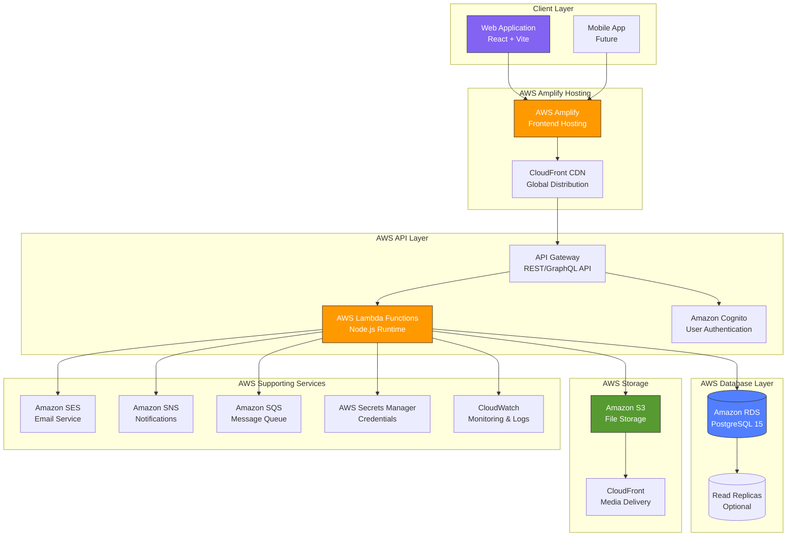
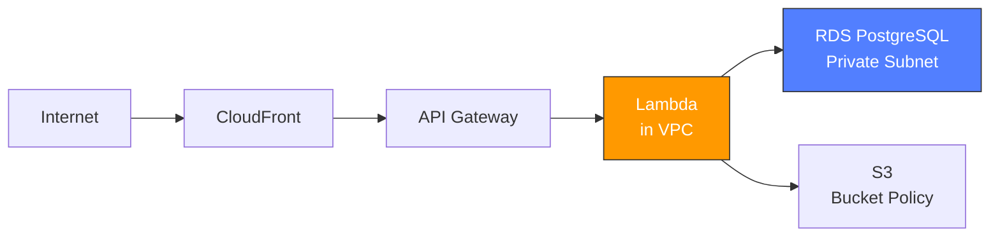
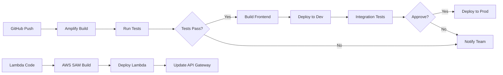

 # AWS Amplify + PostgreSQL Architecture

## Kash Contact Application - Cloud Infrastructure

---

## 🏗️ Architecture Overview



---

## 📋 Component Details

### 1. Frontend Layer - AWS Amplify Hosting

**Service**: AWS Amplify Console
**Purpose**: Host and deploy the React application

#### Features:
- ✅ Continuous deployment from GitHub
- ✅ Automatic SSL/TLS certificates
- ✅ Custom domain support
- ✅ Preview environments for pull requests
- ✅ Global CDN distribution via CloudFront
- ✅ Automatic cache invalidation
- ✅ Environment variable management

#### Configuration:
```yaml
# amplify.yml
version: 1
frontend:
  phases:
    preBuild:
      commands:
        - npm ci
    build:
      commands:
        - npm run build
  artifacts:
    baseDirectory: dist
    files:
      - '**/*'
  cache:
    paths:
      - node_modules/**/*
```

---

### 2. Authentication - Amazon Cognito

**Service**: Amazon Cognito User Pools
**Purpose**: User authentication and authorization

#### Features:
- ✅ Email/password authentication
- ✅ Multi-factor authentication (MFA)
- ✅ Email verification
- ✅ Password reset flows
- ✅ User groups (User, Corporate, Vendor)
- ✅ JWT token management
- ✅ OAuth 2.0 support
- ✅ Social login (optional)

#### User Pool Structure:
```
Cognito User Pool: kash-contact-users
├── User Attributes
│   ├── email (required)
│   ├── phone_number
│   ├── custom:user_type (user/corporate/vendor)
│   └── custom:user_id (RDS UUID)
├── Groups
│   ├── Users
│   ├── Corporate
│   └── Vendors
└── Password Policy
    ├── Minimum length: 8
    ├── Require uppercase: Yes
    ├── Require numbers: Yes
    └── Require symbols: Yes
```

---

### 3. API Layer - AWS API Gateway + Lambda

**Services**: 
- API Gateway (REST or HTTP API)
- AWS Lambda (Node.js 18.x)

#### API Structure:

##### REST API Endpoints:
```
/api/v1
├── /auth
│   ├── POST /register
│   ├── POST /login
│   ├── POST /logout
│   ├── POST /forgot-password
│   └── POST /verify-email
├── /users
│   ├── GET /profile
│   ├── PUT /profile
│   ├── GET /team-members
│   └── POST /team-members
├── /campaigns
│   ├── GET /
│   ├── GET /{id}
│   ├── POST /
│   ├── PUT /{id}
│   ├── DELETE /{id}
│   └── POST /{id}/contribute
├── /services
│   ├── GET /
│   ├── GET /{id}
│   ├── POST / (vendors only)
│   ├── PUT /{id} (vendors only)
│   └── DELETE /{id} (vendors only)
├── /bookings
│   ├── GET /
│   ├── POST /
│   ├── PUT /{id}/approve (vendors only)
│   └── PUT /{id}/cancel
├── /transactions
│   ├── GET /
│   └── GET /{id}
├── /vouchers
│   ├── GET /
│   ├── POST /
│   └── POST /{id}/redeem
├── /messages
│   ├── GET /
│   ├── POST /
│   └── GET /conversation/{userId}
├── /notifications
│   ├── GET /
│   └── PUT /{id}/read
└── /support
    ├── POST /tickets
    ├── GET /tickets
    └── POST /tickets/{id}/messages
```

#### Lambda Functions Architecture:

```
lambda/
├── layers/
│   ├── database/ (PostgreSQL client)
│   ├── utils/ (shared utilities)
│   └── validation/ (request validators)
├── functions/
│   ├── auth/
│   │   ├── register.js
│   │   ├── login.js
│   │   └── verify-email.js
│   ├── campaigns/
│   │   ├── create-campaign.js
│   │   ├── list-campaigns.js
│   │   ├── update-campaign.js
│   │   └── contribute.js
│   ├── services/
│   │   ├── create-service.js
│   │   ├── list-services.js
│   │   └── update-service.js
│   ├── bookings/
│   │   ├── create-booking.js
│   │   ├── approve-booking.js
│   │   └── cancel-booking.js
│   └── payments/
│       ├── process-payment.js
│       └── handle-webhook.js
└── shared/
    ├── db-connection.js
    ├── error-handler.js
    └── response-builder.js
```

---

### 4. Database - Amazon RDS PostgreSQL

**Service**: Amazon RDS for PostgreSQL
**Version**: PostgreSQL 15.x

#### Configuration:

**Instance Type**: db.t4g.medium (Production) / db.t4g.micro (Development)

**Storage**:
- Storage Type: General Purpose SSD (gp3)
- Allocated Storage: 100 GB
- Auto-scaling: Up to 1000 GB

**High Availability**:
- Multi-AZ Deployment: Yes (Production)
- Automated Backups: 7-day retention
- Backup Window: 03:00-04:00 UTC
- Maintenance Window: Sun 04:00-05:00 UTC

**Security**:
- VPC: Private subnet
- Security Groups: Lambda access only
- Encryption at rest: Yes (AWS KMS)
- SSL/TLS: Required
- IAM Database Authentication: Enabled

**Performance**:
- Connection Pooling: RDS Proxy
- Read Replicas: 1-2 (optional)
- Performance Insights: Enabled
- Enhanced Monitoring: Enabled

#### Database Connection:

```javascript
// Lambda function database connection
const { Pool } = require('pg');
const AWS = require('aws-sdk');

// Get credentials from Secrets Manager
const getDbCredentials = async () => {
  const secretsManager = new AWS.SecretsManager();
  const secret = await secretsManager.getSecretValue({
    SecretId: 'kash-contact/rds/credentials'
  }).promise();
  return JSON.parse(secret.SecretString);
};

// Connection pool (reused across Lambda invocations)
let pool;
const getPool = async () => {
  if (!pool) {
    const credentials = await getDbCredentials();
    pool = new Pool({
      host: process.env.DB_HOST,
      port: 5432,
      database: process.env.DB_NAME,
      user: credentials.username,
      password: credentials.password,
      max: 5, // Connection pool size
      ssl: { rejectUnauthorized: true }
    });
  }
  return pool;
};
```

---

### 5. File Storage - Amazon S3

**Service**: Amazon S3
**Purpose**: Store user uploads, campaign images, service media

#### Bucket Structure:

```
kash-contact-media/
├── users/
│   ├── {user-id}/
│   │   ├── profile/
│   │   │   └── avatar.jpg
│   │   └── documents/
│   │       └── verification.pdf
├── campaigns/
│   ├── {campaign-id}/
│   │   ├── cover.jpg
│   │   └── gallery/
│   │       ├── image1.jpg
│   │       └── image2.jpg
├── services/
│   └── {service-id}/
│       └── gallery/
│           └── image1.jpg
└── temp/
    └── uploads/
```

#### S3 Configuration:

- **Versioning**: Enabled
- **Encryption**: AES-256 (server-side)
- **Lifecycle Rules**:
  - Temp files → Delete after 1 day
  - Standard → Intelligent-Tiering after 30 days
- **CORS**: Enabled for web uploads
- **CloudFront**: Distribution for fast media delivery
- **Signed URLs**: For secure uploads/downloads

---

### 6. Supporting Services

#### Amazon SES (Email Service)
- **Purpose**: Transactional emails
- **Use Cases**:
  - Email verification
  - Password reset
  - Campaign notifications
  - Booking confirmations
  - Receipt emails

#### Amazon SNS (Notifications)
- **Purpose**: Push notifications
- **Use Cases**:
  - Campaign updates
  - Booking approvals
  - Payment confirmations
  - System alerts

#### Amazon SQS (Message Queue)
- **Purpose**: Async job processing
- **Use Cases**:
  - Email sending queue
  - Report generation
  - Batch notifications
  - Data exports

#### AWS Secrets Manager
- **Purpose**: Secure credential storage
- **Stored Secrets**:
  - Database credentials
  - API keys (Stripe, etc.)
  - JWT signing keys
  - Third-party integrations

#### Amazon CloudWatch
- **Purpose**: Monitoring and logging
- **Features**:
  - Lambda function logs
  - Database performance metrics
  - API Gateway metrics
  - Custom application metrics
  - Alarms and alerts

---

## 🔒 Security Architecture

### Network Security


### Security Layers:

1. **Network Layer**
   - VPC with private subnets
   - Security groups restricting access
   - NAT Gateway for outbound traffic
   - No public database access

2. **Authentication Layer**
   - Cognito JWT tokens
   - Token expiration (1 hour)
   - Refresh tokens (30 days)
   - MFA support

3. **Authorization Layer**
   - Role-based access (User/Corporate/Vendor)
   - Lambda authorizers
   - Fine-grained permissions

4. **Data Layer**
   - Encryption at rest (RDS, S3)
   - Encryption in transit (TLS/SSL)
   - Secrets Manager for credentials
   - Database connection encryption

5. **Application Layer**
   - Input validation
   - SQL injection prevention (parameterized queries)
   - XSS protection
   - CSRF tokens
   - Rate limiting

---

## 📊 Scalability & Performance

### Auto-Scaling Configuration

#### Lambda Auto-Scaling:
- **Concurrent Executions**: 1000
- **Reserved Concurrency**: 100 (critical functions)
- **Provisioned Concurrency**: 10 (frequently used)

#### RDS Scaling:
- **Vertical Scaling**: Manual instance type upgrade
- **Horizontal Scaling**: Read replicas for queries
- **Storage Auto-Scaling**: Enabled (up to 1 TB)
- **Connection Pooling**: RDS Proxy (500 connections)

#### API Gateway:
- **Rate Limiting**: 10,000 requests/second
- **Burst Limit**: 5,000 requests
- **Caching**: Enabled (5 minutes TTL)

### Performance Optimization:

1. **Database**
   - Indexed columns (35+ indexes)
   - Materialized views for complex queries
   - Query optimization
   - Connection pooling

2. **API**
   - Response caching
   - Compression enabled
   - Pagination (max 100 items)
   - Field filtering

3. **Frontend**
   - CDN caching (CloudFront)
   - Image optimization
   - Code splitting
   - Lazy loading

---

## 💰 Cost Estimation

### Monthly AWS Costs (Estimated)

#### Development Environment:
| Service | Configuration | Monthly Cost |
|---------|--------------|--------------|
| Amplify Hosting | 1 app, 50 GB traffic | $15 |
| Cognito | 50,000 MAU | Free tier |
| API Gateway | 1M requests | $3.50 |
| Lambda | 10M requests, 512MB | $20 |
| RDS PostgreSQL | db.t4g.micro, 20GB | $15 |
| S3 | 50 GB storage, 100GB transfer | $5 |
| CloudWatch | Basic monitoring | $5 |
| **Total** | | **~$65/month** |

#### Production Environment (10,000 active users):
| Service | Configuration | Monthly Cost |
|---------|--------------|--------------|
| Amplify Hosting | 1 app, 500 GB traffic | $80 |
| Cognito | 10,000 MAU | $50 |
| API Gateway | 50M requests | $175 |
| Lambda | 100M requests, 1GB avg | $200 |
| RDS PostgreSQL | db.t4g.medium, Multi-AZ, 100GB | $150 |
| RDS Proxy | Connection pooling | $30 |
| S3 | 500 GB storage, 1TB transfer | $40 |
| CloudFront | 1TB data transfer | $85 |
| SES | 100,000 emails | $10 |
| CloudWatch | Enhanced monitoring | $30 |
| Secrets Manager | 10 secrets | $5 |
| **Total** | | **~$855/month** |

#### Production Environment (100,000 active users):
| Service | Configuration | Monthly Cost |
|---------|--------------|--------------|
| Amplify Hosting | Multi-region, 2TB traffic | $250 |
| Cognito | 100,000 MAU | $525 |
| API Gateway | 500M requests | $1,750 |
| Lambda | 1B requests, 1GB avg | $1,800 |
| RDS PostgreSQL | db.r6g.xlarge, Multi-AZ, 500GB | $800 |
| Read Replicas | 2 replicas | $600 |
| RDS Proxy | Connection pooling | $60 |
| S3 | 2TB storage, 5TB transfer | $150 |
| CloudFront | 10TB data transfer | $750 |
| SES | 1M emails | $100 |
| CloudWatch | Advanced monitoring | $150 |
| SNS/SQS | Notifications | $50 |
| **Total** | | **~$6,985/month** |

---

## 🚀 Deployment Strategy

### CI/CD Pipeline



### Deployment Environments:

1. **Development**
   - Auto-deploy on push to `develop` branch
   - Smaller RDS instance
   - Reduced Lambda memory
   - Lower costs

2. **Staging**
   - Manual deploy from `staging` branch
   - Production-like configuration
   - Testing environment
   - Data anonymization

3. **Production**
   - Manual deploy from `main` branch
   - Full redundancy
   - Multi-AZ deployment
   - Automated backups

---

## 📈 Monitoring & Alerts

### CloudWatch Dashboards:

1. **Application Health**
   - API response times
   - Error rates
   - Request volume
   - Lambda duration

2. **Database Performance**
   - Connection count
   - Query latency
   - CPU utilization
   - Storage usage

3. **User Metrics**
   - Active users
   - Registration rate
   - Campaign creation
   - Transaction volume

### Alerts:

| Metric | Threshold | Action |
|--------|-----------|--------|
| API Error Rate | > 5% | Email + Slack |
| Database CPU | > 80% | Auto-scale + Alert |
| Lambda Errors | > 100/hour | Email team |
| S3 Storage | > 90% capacity | Warning |
| RDS Storage | > 85% capacity | Auto-scale |

---

## 🔧 Database Migration Strategy

### Initial Setup:
```bash
# 1. Create RDS instance via AWS Console or CLI
aws rds create-db-instance \
  --db-instance-identifier kash-contact-db \
  --db-instance-class db.t4g.medium \
  --engine postgres \
  --engine-version 15.4 \
  --allocated-storage 100 \
  --storage-encrypted \
  --master-username dbadmin \
  --master-user-password [secure-password]

# 2. Run initial schema
psql -h <rds-endpoint> -U dbadmin -d kash_contact -f database/schema.sql

# 3. Setup Lambda layers
cd lambda/layers/database
npm install pg
zip -r database-layer.zip .
aws lambda publish-layer-version \
  --layer-name database-pg \
  --zip-file fileb://database-layer.zip
```

### Migration Tools:
- **Schema Migrations**: Flyway or Liquibase
- **Data Migration**: AWS DMS (if migrating from existing DB)
- **Version Control**: Git-tracked SQL migration files

---

## ✅ Benefits of This Architecture

### Technical Benefits:
1. ✅ **Scalability**: Auto-scales to handle traffic spikes
2. ✅ **Reliability**: 99.99% uptime with Multi-AZ
3. ✅ **Security**: Enterprise-grade security layers
4. ✅ **Performance**: Global CDN, optimized queries
5. ✅ **Maintainability**: Serverless = no server management

### Business Benefits:
1. ✅ **Cost-Effective**: Pay only for what you use
2. ✅ **Fast Time-to-Market**: Managed services reduce dev time
3. ✅ **Global Reach**: CloudFront CDN worldwide
4. ✅ **Compliance-Ready**: AWS compliance certifications
5. ✅ **Future-Proof**: Easy to add new features

### Developer Benefits:
1. ✅ **Modern Stack**: TypeScript, PostgreSQL, Serverless
2. ✅ **Easy Debugging**: CloudWatch logs and metrics
3. ✅ **Version Control**: Infrastructure as Code
4. ✅ **Testing**: Isolated dev/staging environments
5. ✅ **Documentation**: Auto-generated API docs

---

## 📝 Next Steps for Implementation

1. ✅ Review and approve architecture
2. ✅ Set up AWS account and budget alerts
3. ✅ Create RDS PostgreSQL instance
4. ✅ Deploy schema and test data
5. ✅ Set up Cognito user pool
6. ✅ Create Lambda functions
7. ✅ Configure API Gateway
8. ✅ Connect Amplify to GitHub
9. ✅ Deploy frontend
10. ✅ Integration testing
11. ✅ Security audit
12. ✅ Performance testing
13. ✅ Production deployment

---

**Document Version**: 1.0  
**Last Updated**: January 5, 2026  
**Prepared For**: Management Presentation
