# Database Entity Relationship Diagram

## Kash Contact Application - PostgreSQL Database Schema

```mermaid
erDiagram
    users ||--o{ corporate_profiles : "has"
    users ||--o{ vendor_profiles : "has"
    users ||--o{ campaigns : "creates"
    users ||--o{ contributions : "makes"
    users ||--o{ services : "offers"
    users ||--o{ bookings : "books"
    users ||--o{ messages : "sends"
    users ||--o{ messages : "receives"
    users ||--o{ notifications : "receives"
    users ||--o{ reviews : "writes"
    users ||--o{ support_tickets : "creates"
    users ||--o{ transactions : "initiates"
    users ||--o{ vouchers : "issues"
    users ||--o{ team_members : "manages"
    users ||--o{ team_members : "member_of"
    users ||--o{ payment_methods : "has"
    users ||--o{ campaign_drafts : "saves"
    users ||--o{ activity_logs : "performs"

    campaigns ||--o{ campaign_services : "includes"
    campaigns ||--o{ contributions : "receives"
    campaigns ||--o{ bookings : "generates"
    campaigns ||--o{ transactions : "involves"
    campaigns ||--o{ vouchers : "rewards_with"
    campaigns ||--o{ reminders : "has"

    services ||--o{ campaign_services : "selected_in"
    services ||--o{ bookings : "booked_as"
    services ||--o{ reviews : "reviewed_in"

    bookings ||--o{ reviews : "generates"
    bookings ||--o{ transactions : "triggers"

    support_tickets ||--o{ support_ticket_messages : "contains"

    contributions ||--o{ transactions : "creates"

    messages }o--|| messages : "replies_to"

    users {
        uuid id PK
        varchar email UK
        varchar password_hash
        user_type user_type
        user_status status
        varchar first_name
        varchar last_name
        varchar phone_number
        text profile_image_url
        text address
        boolean email_verified
        timestamp created_at
        timestamp updated_at
    }

    corporate_profiles {
        uuid id PK
        uuid user_id FK
        varchar company_name
        varchar company_registration_number
        varchar industry
        decimal credit_limit
        decimal current_balance
        timestamp created_at
    }

    vendor_profiles {
        uuid id PK
        uuid user_id FK
        varchar business_name
        varchar service_category
        decimal rating
        integer total_reviews
        varchar bank_name
        varchar account_number
        boolean is_verified
        timestamp created_at
    }

    team_members {
        uuid id PK
        uuid corporate_user_id FK
        uuid member_user_id FK
        varchar role
        jsonb permissions
        user_status status
        timestamp created_at
    }

    campaigns {
        uuid id PK
        uuid creator_id FK
        varchar title
        text description
        campaign_type campaign_type
        campaign_status status
        decimal goal_amount
        decimal current_amount
        date start_date
        date end_date
        integer total_contributors
        boolean is_public
        timestamp created_at
    }

    campaign_services {
        uuid id PK
        uuid campaign_id FK
        uuid service_id FK
        integer quantity
        decimal unit_price
        decimal total_price
        timestamp created_at
    }

    services {
        uuid id PK
        uuid vendor_id FK
        varchar name
        text description
        varchar category
        decimal base_price
        service_status status
        integer available_quantity
        text location_address
        jsonb gallery_images
        decimal average_rating
        timestamp created_at
    }

    bookings {
        uuid id PK
        uuid campaign_id FK
        uuid service_id FK
        uuid vendor_id FK
        uuid customer_id FK
        varchar booking_reference UK
        booking_status status
        integer quantity
        decimal total_price
        date booking_date
        date check_in_date
        date check_out_date
        timestamp created_at
    }

    contributions {
        uuid id PK
        uuid campaign_id FK
        uuid contributor_id FK
        decimal amount
        boolean is_anonymous
        varchar payment_method
        transaction_status status
        timestamp created_at
    }

    transactions {
        uuid id PK
        uuid from_user_id FK
        uuid to_user_id FK
        transaction_type transaction_type
        decimal amount
        transaction_status status
        uuid campaign_id FK
        uuid booking_id FK
        varchar payment_gateway
        timestamp created_at
    }

    vouchers {
        uuid id PK
        uuid issued_by_user_id FK
        uuid campaign_id FK
        varchar code UK
        varchar title
        varchar discount_type
        decimal discount_value
        date valid_from
        date valid_until
        voucher_status status
        uuid redeemed_by_user_id FK
        timestamp created_at
    }

    messages {
        uuid id PK
        uuid sender_id FK
        uuid recipient_id FK
        varchar subject
        text message
        message_status status
        uuid parent_message_id FK
        timestamp created_at
        timestamp read_at
    }

    notifications {
        uuid id PK
        uuid user_id FK
        notification_type type
        varchar title
        text message
        boolean is_read
        timestamp created_at
    }

    reviews {
        uuid id PK
        uuid reviewer_id FK
        uuid service_id FK
        uuid booking_id FK
        integer rating
        text review_text
        text vendor_response
        timestamp created_at
    }

    support_tickets {
        uuid id PK
        uuid user_id FK
        varchar ticket_number UK
        varchar subject
        text description
        varchar category
        varchar priority
        varchar status
        timestamp created_at
    }

    support_ticket_messages {
        uuid id PK
        uuid ticket_id FK
        uuid sender_id FK
        text message
        boolean is_internal
        timestamp created_at
    }

    activity_logs {
        uuid id PK
        uuid user_id FK
        varchar action
        varchar entity_type
        uuid entity_id
        text description
        jsonb metadata
        inet ip_address
        timestamp created_at
    }

    payment_methods {
        uuid id PK
        uuid user_id FK
        varchar type
        varchar provider
        varchar last_four_digits
        varchar token
        boolean is_default
        timestamp created_at
    }

    campaign_drafts {
        uuid id PK
        uuid user_id FK
        jsonb draft_data
        integer completion_percentage
        timestamp created_at
        timestamp updated_at
    }

    reminders {
        uuid id PK
        uuid campaign_id FK
        uuid created_by_user_id FK
        varchar title
        text message
        timestamp scheduled_for
        varchar status
        jsonb recipient_ids
        timestamp created_at
    }
```

## Database Statistics

### Total Tables: 22

#### Core Tables (7)
- **users**: Main user account table
- **corporate_profiles**: Corporate account extensions
- **vendor_profiles**: Vendor account extensions
- **team_members**: Corporate team management
- **campaigns**: Campaign management
- **services**: Vendor services/products
- **bookings**: Service bookings

#### Transaction Tables (3)
- **contributions**: Campaign contributions
- **transactions**: All financial transactions
- **vouchers**: Reward vouchers

#### Communication Tables (3)
- **messages**: Direct messaging
- **notifications**: System notifications
- **support_tickets**: Customer support
- **support_ticket_messages**: Support ticket threads

#### Supporting Tables (6)
- **campaign_services**: Campaign-service relationships
- **reviews**: Service reviews
- **payment_methods**: Saved payment options
- **campaign_drafts**: Draft campaigns
- **reminders**: Campaign reminders
- **activity_logs**: Audit trail

## Key Relationships

### One-to-Many Relationships
- User → Multiple Campaigns
- User → Multiple Contributions
- User → Multiple Bookings
- Campaign → Multiple Contributions
- Campaign → Multiple Services
- Service → Multiple Bookings
- Booking → Reviews

### Many-to-Many Relationships
- Campaigns ↔ Services (via campaign_services)
- Corporate Users ↔ Team Members (via team_members)

### Self-Referencing Relationships
- Messages → Parent Messages (threading)

## Indexes Summary

**Total Indexes: 35+**

### Performance Optimizations
- Email lookups (unique index)
- User type filtering
- Campaign status queries
- Date range queries
- Transaction history
- Message threads
- Notification feeds

## Database Features

### Advanced PostgreSQL Features Used
1. **UUID Primary Keys**: Secure, distributed-friendly IDs
2. **JSONB Columns**: Flexible schema for metadata, images, permissions
3. **ENUM Types**: Type-safe status fields
4. **Triggers**: Automatic timestamp updates, calculated fields
5. **Functions**: Business logic at database level
6. **Views**: Optimized query patterns
7. **Constraints**: Data integrity (check, unique, foreign keys)
8. **Indexes**: Query performance optimization

### Security Features
- Password hashing (bcrypt)
- Soft deletes (deleted_at)
- Audit logging (activity_logs)
- Role-based access (team_members)
- Token-based payment methods

### Scalability Features
- Indexed foreign keys
- JSONB for flexible data
- Optimized queries via views
- Partitioning-ready structure
